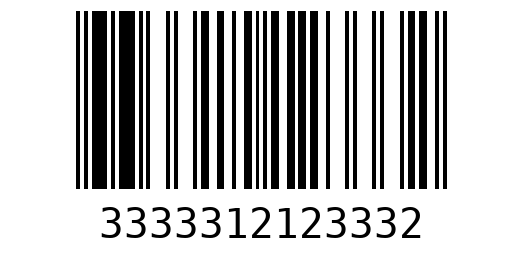

| Python-Barcode-GhostCodeNight |
|---------|
|<p align="justify">Barcode adalah sebuah kode yang terdiri dari garis-garis hitam dan putih dengan ketebalan bervariasi serta spasi di antara mereka, yang digunakan untuk merepresentasikan data secara visual. Data ini dapat di-scan oleh mesin pembaca barcode (barcode scanner) dan diinterpretasikan ke dalam bentuk informasi digital, Barcode sering digunakan untuk pelacakan produk di berbagai industri, seperti di kasir untuk mengidentifikasi harga dan informasi produk. Ada beberapa jenis barcode, termasuk barcode 1D (seperti UPC atau EAN) dan barcode 2D (seperti QR code). Masing-masing barcode ini dapat menyimpan jumlah data yang berbeda, dengan barcode 2D umumnya mampu menyimpan lebih banyak data dibandingkan barcode 1D.</p>  |

```
https://www.python.org/downloads/
```
```
pip install Pillow
```
```
pip install pyzbar
```
```
pip install python-barcode
```

